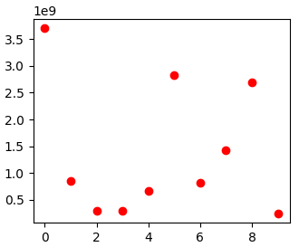

Habu: Network Hacking Toolkit
=============================

These are basic functions that help with some tasks for Ethical Hacking and Penetration Testing.

I'm developing Habu to teach (and learn) some concepts about Python and Network Hacking.

Much of the functions are really basic (like get our public IP address), but are really useful in some cases.

Installation
------------

To install Habu, simply:

.. code-block:: bash

    $ pip install habu

Dependencies
------------
Habu requires:

- Click
- Python (3.x),
- Scapy-Python3
- Matplotlib (Optional, only needed if you want to make some graphs)

Get Help
--------
All the commands implement the option '--help', that shows the help, arguments, 
options, and default values.

Verbose Mode
------------
Almost all commands implement the verbose mode with the '-v' option. This can give 
you some extra info about what habu is doing.

habu.arpoison: ARP Poisoning
----------------------------
This command sends ARP 'is-at' packets to each victim, poisoning their ARP tables
for send the traffic to your system.

.. code-block:: bash

    $ sudo habu.arpoison 192.168.1.5 192.168.1.6
    Ether / ARP is at 00:c2:c6:30:2c:58 says 192.168.1.6
    Ether / ARP is at 00:c2:c6:30:2c:58 says 192.168.1.5
    Ether / ARP is at 00:c2:c6:30:2c:58 says 192.168.1.6
    Ether / ARP is at 00:c2:c6:30:2c:58 says 192.168.1.5
    ...

**Note**: If you want a full working Man In The Middle attack, you need to enable 
the packet forwarding on your operating system to act like a router. You can do 
that using:

.. code-block:: bash

    echo 1 > /proc/sys/net/ipv4/ip_forward

habu.arpsniff: Discover devices on your LAN capturing ARP packets
-----------------------------------------------------------------
This command listen for ARP packets and shows information each device.

Columns: Seconds from last packet | IP | MAC | Vendor

.. code-block:: bash

    1   192.168.0.1	    a4:08:f5:19:17:a4   Sagemcom Broadband SAS
    7   192.168.0.2	    64:bc:0c:33:e5:57   LG Electronics (Mobile Communications)
    2	192.168.0.5	    00:c2:c6:30:2c:58   Intel Corporate
    6   192.168.0.7	    54:f2:01:db:35:58   Samsung Electronics Co.,Ltd

habu.contest: Check your connection capabilities
------------------------------------------------
This command tries to connect to various services and check if you can reach them using your internet connection.

.. code-block:: bash

    $ habu.contest 
    IP:    True
    DNS:   True
    FTP:   True
    SSH:   True
    HTTP:  True
    HTTPS: True

habu.dhcp_discover: Discover DHCP servers
-----------------------------------------
This command send a DHCP request and shows what devices has replied. Using the '-v' parameter (verbose) you can 
see all the options (like DNS servers) included on the responses.

.. code-block:: bash

    $ sudo habu.dhcp_discover 
    Ether / IP / UDP 192.168.0.1:bootps > 192.168.0.5:bootpc / BOOTP / DHCP

habu.eicar: Prints the EICAR test string
----------------------------------------
This command prints the EICAR test string that can be used to test antimalware engines. More info: 
http://www.eicar.org/86-0-Intended-use.html

.. code-block:: bash

    $ habu.eicar 
    X5O!P%@AP[4\XZP54(P^)7CC)7}$EICAR-STANDARD-ANTIVIRUS-TEST-FILE!$H+H*

**Note:** The below string is incorrect because is not a good idea write the complete in this text file. 
Some antivirus program can be detect it like a virus.  :)

habu.hasher: Computes various hashes with the input data
--------------------------------------------------------
This command computes various hashes for the input data, that can be a file or a stream.

If the filename is '-', the data is taken from the standard input (stdin) so, three different 
variants exists to call this command:

.. code-block:: bash

    $ habu.hasher README.rst 
    md5  : 375375d9cfb2aacab7c8d1a9afd3d9b7
    sha1 : 21c67b9ef44bc24d47eef6adab648ba34662927e
    
    $ cat README.rst | habu.hasher -
    md5  : 375375d9cfb2aacab7c8d1a9afd3d9b7
    sha1 : 21c67b9ef44bc24d47eef6adab648ba34662927e
    
    $ habu.hasher - < README.rst 
    md5  : 375375d9cfb2aacab7c8d1a9afd3d9b7
    sha1 : 21c67b9ef44bc24d47eef6adab648ba34662927e

**Note:** The output above shows only MD5 and SHA1 to make it short, but the real output 
includes more algorithms.

You can also specify which algorithm to use. In such case, the output is only the value 
of the calculated hash:

.. code-block:: bash

    $ habu.hasher -a md5 README.rst
    375375d9cfb2aacab7c8d1a9afd3d9b7

habu.ip: Prints your current public IP
--------------------------------------
This command prints your current public IP based on the response from https://api.ipify.org.

.. code-block:: bash

    $ habu.ip 
    182.26.32.246

habu.isn: Prints the TCP sequence numbers for an IP
---------------------------------------------------
This command creates TCP connections and prints the TCP initial sequence numbers for each connections.

.. code-block:: bash

    $ sudo habu.isn www.portantier.com
    1962287220
    1800895007
    589617930
    3393793979
    469428558

You can get a graphical representation (needs the matplotlib package) using the '-g' option:

.. code-block:: bash

    $ sudo habu.isn -g -c 10 www.portantier.com

**Note:** The above command uses '-c' option to define that 10 connections must be created.

habu.land: Implements the LAND attack
-------------------------------------
This command implements the LAND attack, that sends packets forging the source IP address 
to be the same that the destination IP. Also uses the same source and destination port.

The attack is very old, and can be used to make a Denial of Service on old systems, like 
Windows NT 4.0. More information here: https://en.wikipedia.org/wiki/LAND

.. code-block:: bash

    sudo habu.land 172.16.0.10
    ............

**Note:** Each dot (.) is a sent packet. You can specify how many packets send with the '-c' option. The default is never stop. Also, you can specify the destination port, with the '-p' option.

habu.ping: ICMP echo requests
-----------------------------
This command implements the classic 'ping' with ICMP echo requests.

.. code-block:: bash

    $ sudo habu.ping 8.8.8.8
    IP / ICMP 8.8.8.8 > 192.168.0.5 echo-reply 0 / Padding
    IP / ICMP 8.8.8.8 > 192.168.0.5 echo-reply 0 / Padding
    IP / ICMP 8.8.8.8 > 192.168.0.5 echo-reply 0 / Padding
    IP / ICMP 8.8.8.8 > 192.168.0.5 echo-reply 0 / Padding

habu.snmp_crack: SNMP Community Cracker
---------------------------------------
This command launches snmp-get queries against an IP, and tells you when finds a valid 
community string (is a simple SNMP cracker).

The dictionary used is the distributed with the onesixtyone tool 
(https://github.com/trailofbits/onesixtyone)

.. code-block:: bash

    $ sudo habu.snmp_crack 179.125.234.210 
    Community found: private
    Community found: public

**Note:** You can also receive messages like <UNIVERSAL> <class 'scapy.asn1.asn1.ASN1_Class_metaclass'>,
I don't know how to supress them for now.

habu.synflood: SYN Flood Attack Implementation
----------------------------------------------
This command launches a lot of TCP connections and keeps them opened. Some very old systems can 
suffer a Denial of Service with this. More info: https://en.wikipedia.org/wiki/SYN_flood

.. code-block:: bash

    $ sudo habu.synflood 172.16.0.10
    .................

Each dot is a packet sent.

You can use the options '-2' and '-3' to forge the layer 2/3 addresses. If you use them, each connection 
will be sent from a random layer2 (MAC) and/or layer3 (IP) address.

You can choose the number of connections to create with the option '-c'. The default is never stop 
creating connections.

habu.tcpflags: TCP Flag Fuzzer
------------------------------
This command send TCP packets with different flags and tell you what responses receives.

It can be used to analyze how the different TCP/IP stack implementations and configurations responds to 
packet with various flag combinations.

.. code-block:: bash

    $ sudo habu.tcpflags www.portantier.com
    S  -> SA
    FS -> SA
    FA -> R
    SA -> R

By default, the command sends all possible flag combinations. You can specify with flags must ever be 
present (reducing the quantity of possible combinations), with the option '-f'.

Also, you can specify which flags you want to be present on the response packets to show, with the 
option '-r'.

With the next command, you see all the possible combinations that have the FIN (F) flag set and 
generates a response that contains the RST (R) flag.

.. code-block:: bash

    $ sudo habu.tcpflags -f F -r R www.portantier.com
    FPA  -> R       
    FSPA -> R       
    FAU  -> R       
